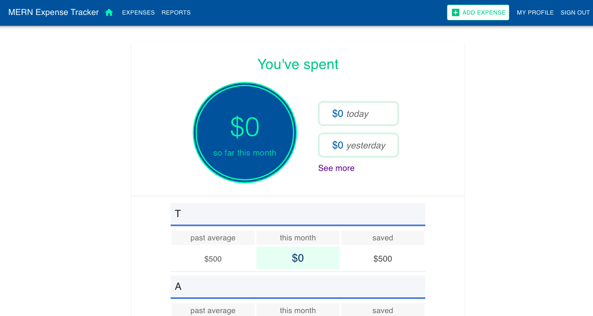

# 💰💰 📊  📈 Expense Tracking Application 
Building a Expense Tracking Application using MERN stack.

# Motivation 
To keep tracking our all expenses.

# Build status

# Code Style
- Server side code **standard**
- Client side code **PascalCase** 

# Screenshots

# Tech/framework used

- [Node](https://nodejs.org/en/)
- [Express](https://expressjs.com/)
- [PostgreSQL](https://www.postgresql.org/)
- [React](https://reactjs.org/)
- [React Router DOM](https://reactrouter.com/web/guides/quick-start)
- [Heroku](https://www.heroku.com)

# Features
- All CRUD operations 
- Different Category 
- Graphs

# Credits
none

# License
MIT © Dherendra Dev
